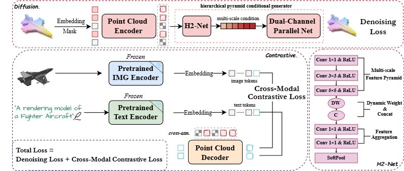

# PointDico [IJCNN2025](https://2025.ijcnn.org/) 

## PointDico: Contrastive 3D Representation Learning Guided by Diffusion Models 
## TL;DR Summary
We propose PointDico, the first diffusion-guided contrastive learning framework for point cloud pre-training.


<div  align="center">    
 
</div>

[Pengbo Li](https://github.com/420688166), [Yiding Sun*](https://github.com/Issac-Sun), Haozhe Cheng

Beijing University of Posts and Telecommunications, 
Xi'an Jiaotong University
## 1. Installation
- PyTorch >= 1.10.0;
- python >= 3.7.12;
- CUDA >= 11.1;

```
# Install dependencies
pip install -r requirements.txt
```

```
# PointNet++
pip install "git+https://github.com/erikwijmans/Pointnet2_PyTorch.git#egg=pointnet2_ops&subdirectory=pointnet2_ops_lib"

# GPU kNN
pip install --upgrade https://github.com/unlimblue/KNN_CUDA/releases/download/0.2/KNN_CUDA-0.2-py3-none-any.whl

# SoftPool
git clone https://github.com/alexandrosstergiou/SoftPool.git
cd SoftPool-master/pytorch
make install
```

## 2. Data Preparation

We use ShapeNet, ScanObjectNN, ShapeNetPart in this work. For more details, please refer to [DATASET.md](./DATASET.md).

## 3. PointDico pre-training

Run the following command to pre-train the PointDico model on ShapeNet:
```
CUDA_VISIBLE_DEVICES=<GPUs> python main.py --config cfgs/pretrain.yaml --exp_name <output_file_name>
```

## 5. Pointdico fine-tuning
Run the following command to fine-tune the Pointdico model on ScanObjectNN:
```
CUDA_VISIBLE_DEVICES=<GPUs> python main.py --config cfgs/finetune_scan_hardest.yaml \
--finetune_model --exp_name <output_file_name> --ckpts <path/to/pre-trained/model>
```

## 6. Acknowledgements

Our codes are built upon [PointDif](https://github.com/zhengxiaozx/PointDif/tree/main), [RECON](https://github.com/qizekun/ReCon), [Point-MAE](https://github.com/Pang-Yatian/Point-MAE/tree/main). Many thanks for their pioneering works! Please consider citing their work if you find our work helpful.

## 7. Citation
If you find PointDico useful to your research, please consider star or cite our work.
```
To be updated upon proceeding publication
```
